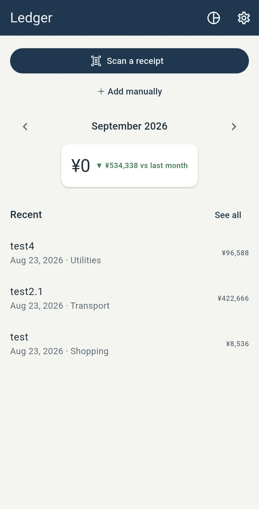
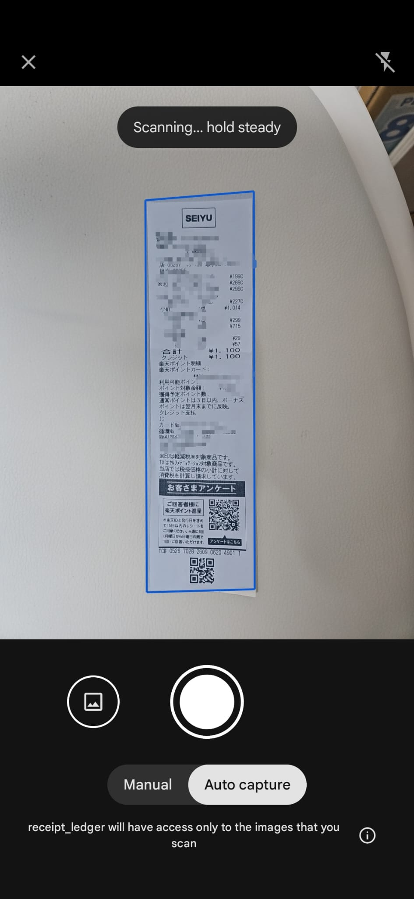
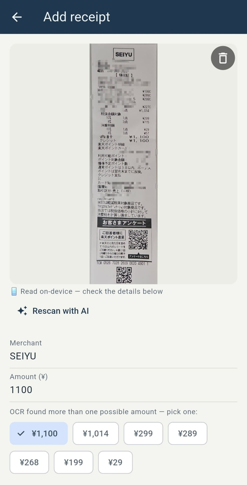
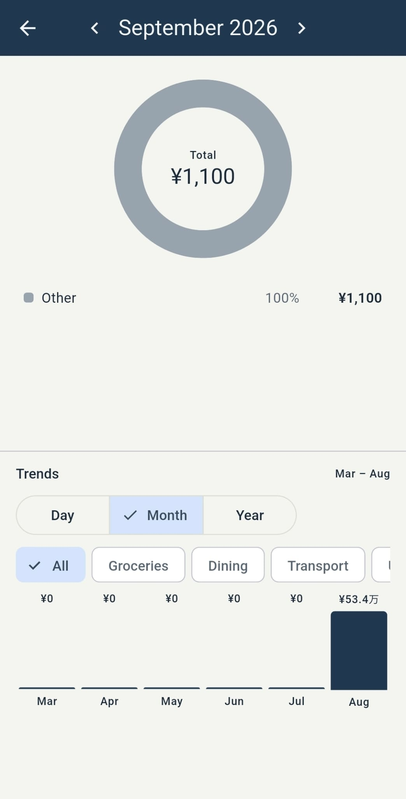

# Receipt Ledger

A Flutter expense tracker for Japanese receipts. Photograph a receipt and it reads the merchant, total and date for you — on-device first, with an optional cloud AI pass for the ones that are hard to read. Receipts sync per account, so they survive a lost phone.

Built for Android, in Japanese yen (whole yen, no decimal subunit).

## Screenshots

<table>
  <tr>
    <td align="center"><br>Dashboard</td>
    <td align="center"><br>Scan</td>
    <td align="center"><br>Confirm &amp; OCR</td>
    <td align="center"><br>Breakdown &amp; trends</td>
  </tr>
</table>

## What it does

- **Scan a receipt** — ML Kit's document scanner handles camera capture, edge detection, gallery import and cropping in one native flow.
- **Read it automatically** — on-device OCR (ML Kit, Japanese script) extracts merchant, total and date. When it gets a messy receipt wrong, **Rescan with AI** sends the photo to Gemini via a Cloud Function for a second opinion.
- **Remembered categories** — correct a merchant's category once and the app files that merchant the same way next time, offering to bring its earlier receipts in line.
- **Spending views** — monthly summary with a trend against last month, a searchable/filterable list, a category donut, and a day/month/year trends chart.
- **Trash** — deletes are soft, with a 30-day window and restore, purged automatically at sign-in.
- **Works offline** — add and edit receipts with no signal; writes queue locally and sync on reconnect.

## Tech stack

| Area | Choice |
|---|---|
| App | Flutter (Dart), Android target |
| Auth | Firebase Auth — Google Sign-In + email/password |
| Data | Cloud Firestore, per account at `/users/{uid}/receipts/{id}` |
| Photos | Cloud Storage, resized client-side before upload |
| On-device OCR | ML Kit text recognition (Japanese) + document scanner |
| Cloud OCR | Gemini, behind a Firebase Cloud Function (TypeScript) |
| State | Plain `StreamBuilder` + constructor injection — no state-management package |
| Tests | `flutter_test`, `fake_cloud_firestore` |

## Running it

**Prerequisites:** Flutter SDK, an Android device or emulator, Node.js (only if you want to deploy the Cloud Function).

```bash
flutter pub get
flutter run
```

This is a **bring-your-own-Firebase** app: no backend config is committed, so you run entirely on **your own** Firebase project and **your own** Gemini key — you consume your own quota, never anyone else's. `lib/firebase_options.dart` and `android/app/google-services.json` are gitignored; see the `*.example` files next to them for the shape. Set it up once:

1. Create **your own** Firebase project, then `dart pub global activate flutterfire_cli` and `flutterfire configure --platforms=android`. This generates `lib/firebase_options.dart` and `android/app/google-services.json` with your project's values.
2. In the Firebase console, enable **Authentication** (Email/Password and Google), **Firestore**, and **Storage**. For Google Sign-In, add your debug SHA-1 fingerprint (`cd android && ./gradlew signingReport`).
3. Deploy the security rules and the index:
   ```bash
   firebase deploy --only firestore:rules,firestore:indexes,storage
   ```

### Locking down your deployment

The security rules already restrict every user to their own `/users/{uid}` subtree, so nobody can read another account's data. But by default **anyone can create an account** on your project, and each signed-in user's uploads bill *your* Blaze plan. If your project is personal or shared with a known group, tighten it:

- **Disable public sign-up** — Firebase console → Authentication → Settings → *User actions* → turn off **Enable create (sign-up)**. Existing accounts keep working; nobody new can register.
- **Enable App Check** (Play Integrity) and enforce it on Firestore, Storage, and the Cloud Function, so only requests from your genuine app binary are accepted.
- **Restrict your Android API key** in Google Cloud Console (package name + SHA-1) and keep a **budget alert** — Blaze has no automatic spending cap.

### The AI rescan (optional)

The app works fully without this — it just falls back to on-device OCR.

```bash
cd functions
npm install
cp .env.example .env      # then put your own Gemini API key in it
npm run deploy
```

Get a key from [Google AI Studio](https://aistudio.google.com/apikey). `functions/.env` is gitignored and additionally blocked by a pre-commit hook.

### Tests

```bash
flutter test
```

95 tests cover the pure logic and the data layer. Note that the widget tests are flaky specifically on Windows (an environment issue with `flutter_tester`, not the code) — they carry a 30s timeout so a hang fails fast rather than blocking. `flutter analyze` is the reliable signal there.

## Architecture notes

Business logic is deliberately kept out of widgets. Month totals, trend buckets, category memory, filtering, receipt-text parsing and image resizing are all plain Dart functions over a `List<Receipt>`, unit-tested directly rather than through the UI.

Storage sits behind an abstract `ReceiptRepository`, so the app was migrated from local SQLite (drift) to Firestore by writing one new implementation — screens didn't change. Tests use an in-memory fake of the same interface.

Some decisions worth knowing about:

- **Firestore writes aren't awaited to the server.** Firestore only completes a write's future once the server acknowledges it, which offline never happens. Awaiting froze the form on Save; the local cache already has the data and the SDK replays the write on reconnect. Document IDs are generated client-side for the same reason.
- **Photos have two fields.** `photoPath` is a device-local path, `photoUrl` is the uploaded copy. Display prefers the local file when it actually exists on disk (instant, offline, no download) and falls back to the cloud copy — a synced `photoPath` is meaningless on a device that never had the file.
- **`createdAt` exists because IDs stopped being sequential.** "Which category did I last use for this merchant" used to fall out of an autoincrementing integer ID. Firestore IDs are random, so the ordering had to become explicit.
- **A billing kill-switch was built and then deleted.** It disabled billing when spend crossed a budget. Disabling billing can take project resources with it, so an automated process holding that power was a worse risk than the small bill it guarded against. The budget remains as an email alert. It's in the git history.

## Known limitations

- Android only. Nothing is iOS-hostile, but it's untested there.
- On-device OCR has an accuracy ceiling on dense receipts — that's what the AI rescan is for.
- Free-tier Gemini submissions may be used by Google to improve their products; a paid key avoids this.
- No cross-device conflict resolution: editing the same receipt offline on two devices is last-write-wins.
